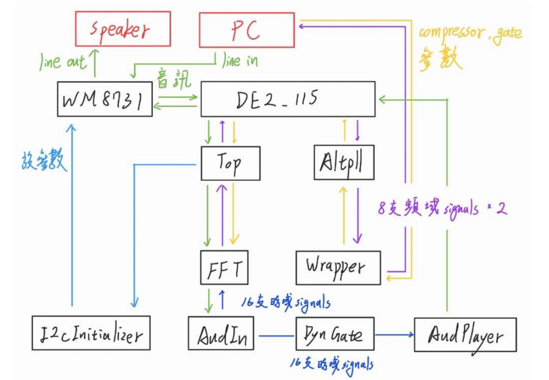
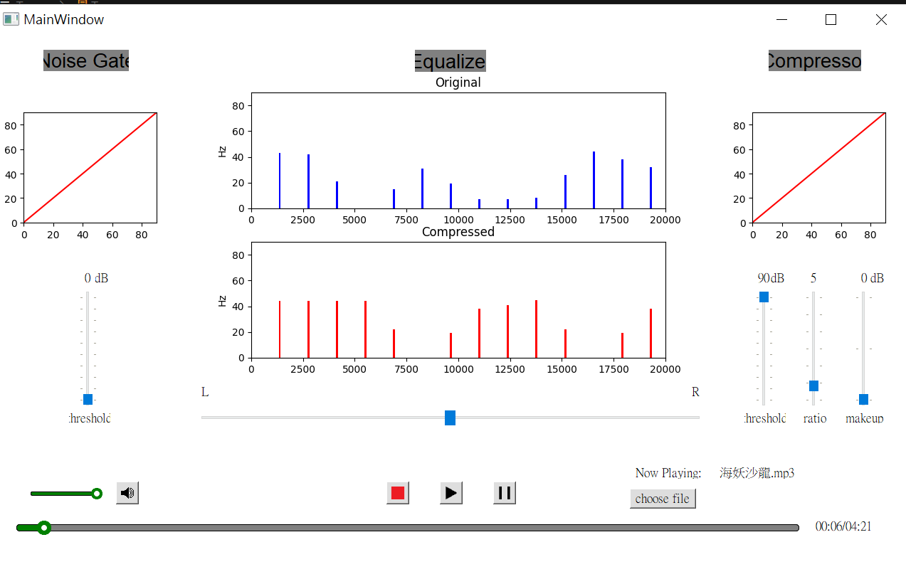

# Real-time_FFT_and_Effctor
## final project of NTUEE digital circuit lab
### What can it do
* we provide a python GUI interface that can be used to read music
* you can check FFT result on the screen
* you can modify the music via compressor just like using a simplified music efftor
* supported parameters: threshold, ratio, makeup
### Block Diagram

### How to run
* prepare a FPGA board
* execute src/python/controller.py
* You will see:

